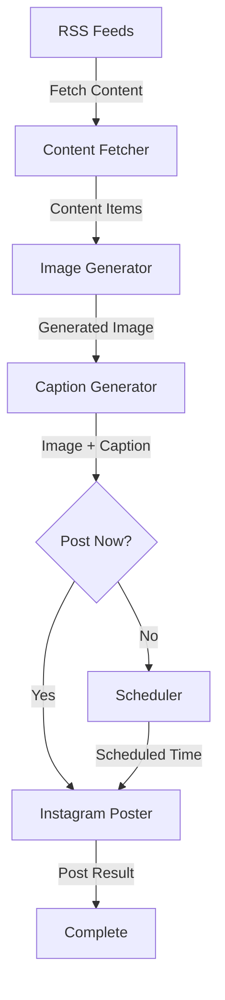

# Social Scheduler


An AI-powered social media content scheduler that fetches content from RSS feeds, generates images using DALL-E, creates captions with OpenAI, and posts to Instagram.

## Features

- Fetch content from RSS feeds
- Generate images using DALL-E
- Create captions using OpenAI
- Schedule and post content to Instagram



## Installation

1. Clone the repository:

2. Create a virtual environment and install dependencies:

```bash
python -m venv venv
source venv/bin/activate
pip install -r requirements.txt
```

3. Create a `.env` file with your API keys:

OPENAI_API_KEY=your_openai_api_key
INSTAGRAM_USERNAME=your_instagram_username
INSTAGRAM_PASSWORD=your_instagram_password
RSS_FEEDS=your_rss_feed_url1,your_rss_feed_url2
POSTING_FREQUENCY=daily,weekly
POSTING_TIME=HH:MM


## Running the App


1. Run via Gradio
2. Run via CLI

### Option 1: Run via Gradio
python -m social_scheduler.frontend

### Option 2: Run via CLI:
#### Create and schedule a post
python -m social_scheduler.cli create-post -r 1

#### List scheduled posts
python -m social_scheduler.cli list-scheduled

#### Post a scheduled item immediately
python -m social_scheduler.cli post-now post_id


## Future Work

### Enhanced Content Generation
- **Video Generation**: Integrate with video generation APIs to create short-form video content
- **Multi-platform Support**: Extend posting capabilities to Twitter, LinkedIn, and Facebook
- **Content Variation**: Generate multiple versions of captions and images for A/B testing

### Technical Improvements
- **Workflow Orchestration**: Implement Airflow or Prefect for more robust scheduling and workflow management
- **Containerization**: Create Docker images for easier deployment and scaling
- **User Authentication**: Develop a Next.js frontend with user login portal for multi-user support
- **Analytics Dashboard**: Add tracking and reporting of post performance metrics

### Infrastructure
- **Cloud Deployment**: Create deployment scripts for AWS, GCP, or Azure
- **Database Integration**: Replace file-based storage with a proper database (PostgreSQL, MongoDB)
- **API Gateway**: Build a RESTful API layer for third-party integrations
- **Monitoring**: Add logging, monitoring, and alerting for production use

### Advanced Features
- **Content Calendar**: Visual calendar interface for planning and scheduling posts
- **Audience Analysis**: Integrate with social media APIs to analyze audience engagement
- **Smart Scheduling**: Use ML to determine optimal posting times based on engagement data
- **Content Recycling**: Automatically refresh and repost high-performing content