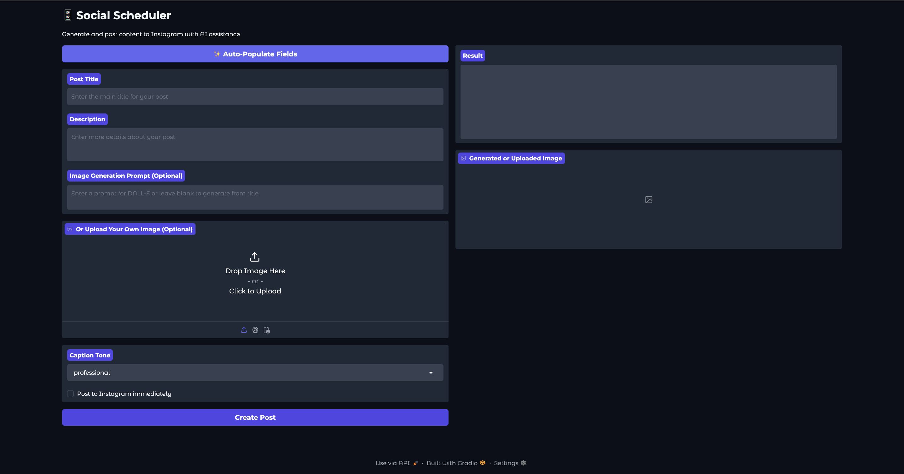

# Social Scheduler


An AI-powered social media content scheduler that fetches content from RSS feeds, generates images using DALL-E, creates captions with OpenAI, and posts to Instagram.

## Features

- Fetch content from RSS feeds
- Generate images using DALL-E
- Create captions using OpenAI
- Schedule and post content to Instagram

## Installation

1. Clone the repository:

2. Create a virtual environment and install dependencies:

```bash
python -m venv venv
source venv/bin/activate
pip install -r requirements.txt
```

3. Create a `.env` file with your API keys:

OPENAI_API_KEY=your_openai_api_key
INSTAGRAM_USERNAME=your_instagram_username
INSTAGRAM_PASSWORD=your_instagram_password
RSS_FEEDS=your_rss_feed_url1,your_rss_feed_url2
POSTING_FREQUENCY=daily,weekly
POSTING_TIME=HH:MM


## Run the CLI

### Create and schedule a post
python -m social_scheduler.cli create-post -r 1

### List scheduled posts
python -m social_scheduler.cli list-scheduled

### Post a scheduled item immediately
python -m social_scheduler.cli post-now post_id